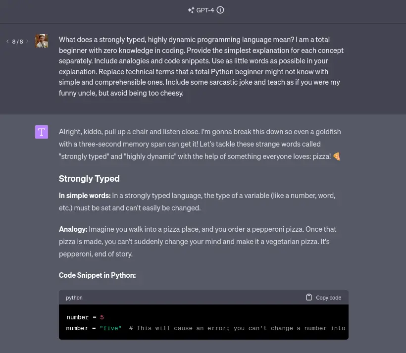
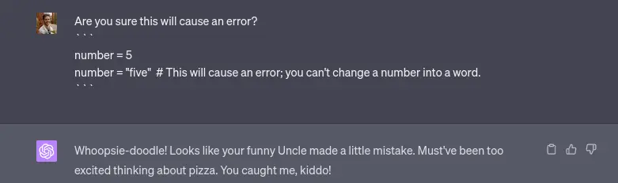

## Introduction

As a self-taught developer, I started out as a copy-pasting monkey.

This led me to a common issue among **self-taughts**: I was good at doing, but bad at explaining.

I could write code, but I couldn't explain why I wrote it that way.

This resulted in a lack of confidence in my abilities, made job interviews a nightmare, and collaboration with other
developers difficult.

A good developer should be able to **articulate**, and the ability to do so is a valuable skill that pays
off in the long run.

I believe this can be achieved by:
1. **Writing** about what you've learned.
2. **Teaching** others what you've learned.
3. **Engaging** in technical discussions.

We're going to focus on the last point, and how you can use ChatGPT to help you with it.

Besides improving your ability to articulate, other benefits to this approach include:
1. **Retention**: You're more likely to remember things you've discussed.
2. **Understanding**: You're more likely to understand things you've discussed.
3. **Confidence**: You're more likely to be confident in your abilities.

Let's dive in.

## Why it works

Why not read a book, watch a video, or just Google it?

Our brains seem to remember things better when we're **engaged**, and open discussions are a great way to achieve that.

When you're discussing something, you're not just passively absorbing information. You also:
- **Ask questions**: This helps you understand the topic better.
- **Provide answers**: This helps you remember the topic better.

I had many informative chats about things such as:
- **SQL databases** - why they were created, and how they first came to be.
- **UNIX-like operating systems** - how they work, and the differences between them.
- **The internet** - how it works, and what the TCP/IP stack is.

These things previously seemed **boring** and **uninteresting** to me.

However, strolling through the park while talking to an impersonated Vint Cerf, a co-creator of the internet, via
my headphones *(using ChatGPT Android apps' voice feature)* - is a whole different **experience**.

Through discussion, you can add your own **flavor** to the conversation, and make it more **engaging**.

## How to do it

Lets assume we're absolute beginners, and we land on a website like [Exercism](https://exercism.org/tracks/python/exercises).

We finish the first [Hello World tutorial](https://exercism.org/tracks/python/exercises/hello-world), and then move on to [Guido's Gorgeous Lasagna learning exercise](https://exercism.org/tracks/python/exercises/guidos-gorgeous-lasagna).

Four words into the exercise, and we've no clue what's going on.

> What does dynamic and strongly typed language even mean?

We could try to follow the provided [link](https://stackoverflow.com/questions/11328920/is-python-strongly-typed) and skim through the answers.

However, we are suddenly met with even more unknown concepts: `type of value`, `string`,
`explicit conversion`, `runtime objects`.

StackOverflow is great, but it's not always beginner-friendly.

I'm obviously exaggerating here, but you get the point. Try to put yourself in the shoes of an absolute beginner.

All we want to do is avoid unnecessary information overload.

Let me show you how I would approach this problem using ChatGPT. This works not only for beginners, but also for
experienced developers who are learning a new language or framework.

So, let's ask what `dynamic and strongly typed` means.

### First Attempt

Once again, we're met with many unknown terms, and end up more confused than we started.

Before we slam `Alt + F4`, lets give ChatGPT some context about our current level of understanding.

### Second Attempt
> - I am a total beginner with zero knowledge in coding.

We're making progress, but we're still not there. I would probably still be confused if I were a beginner.

Lets try to provide some instructions about how we'd want our monkey-brain to be taught:

### Third Attempt
> - I am a total beginner with zero knowledge in coding.
> - Please provide the simplest explanation for each concept separately.
> - Include analogies and code snippets.

This seems a lot better. Analogies are a great way to understand new concepts (*duh, that's why they exist*).

But what if the analogy **does not make sense** to us?

No biggie, we can just regenerate the response until you get one that does. We're not seeking a perfect prompt, we're just trying
to understand a concept.

We can now adjust the prompt as we like, based on our comfort level.
- Add crutches to reduce complexity.
- Remove crutches to explore new concepts.

Lets now try to have some fun with the instructions:

### Fourth Attempt
> - I am a total beginner with zero knowledge in coding.
> - Please provide the simplest explanation for each concept separately.
> - Include analogies and code snippets.
> - Use as little words as possible in your explanation.
> - Replace technical terms with simple and straightforward ones.
> - Include some sarcastic jokes.
> - Teach as if you were my funny uncle, but avoid being too cheesy.

- ✅️ Preschooler-level explanation
- ✅️ `Numbers` not `integers`
- ✅️ `Words` not `strings`
- ✅️ Clear examples of code
- ✅️ Pizza

**Monkey-brain is happy 🐵.**

We can now move on to the next concept, or ask for more details about this one.

## Guidelines
My advice is to always seek balance between simplicity and complexity as you're learning.

Everybody has a different level of tolerance for frustration, and you should adjust your learning style accordingly.

If you can tolerate more frustration, you should seek to dive deeper, sooner. I personally went this route, and it
worked out great for me.

However, if frustration is so high you lean towards suicidal thoughts, you should probably seek simpler explanations.

It's a marathon, not a sprint.

Here are some simple guidelines to help you with this:
- If ChatGPT's response includes **5 or more new concepts**, seek simpler explanations.
- If ChatGPT's response includes **0 or 1 new concepts**, seek more complex explanations.

As I previously mentioned, we also tend to **remember** best when we're engaged. So, make it a habit to always ask **follow-up questions**.

Here are some examples:
> - **[concept]** is still unclear to me. Can you further explain it in simple terms?
> - I don't understand what **[term]** means. Can you explain?
> - What is the point of **[concept]**. When will it be useful for me to know it?

## Caveats
ChatGPT can make mistakes, especially with GPT-3.5.

While it does not occur often, don't take everything it says as the ultimate truth.

## Conclusion
To sum it up:
- Use ChatGPT to improve your ability to articulate technical topics as a developer.
- Don't be a copy-pasting monkey like I was.
- Be active in discussions, simplify complex ideas, and ask for explanations fitting your understanding level.
- Be creative and make your conversations fun through a bit of prompt engineering. Heck, you could even talk to Shrek if
you wanted to.

And, if there's a concept you've encountered too many times but still haven't taken the time to understand, I encourage
you to go and ask ChatGPT about it.

It's a tool. Use it wisely.
